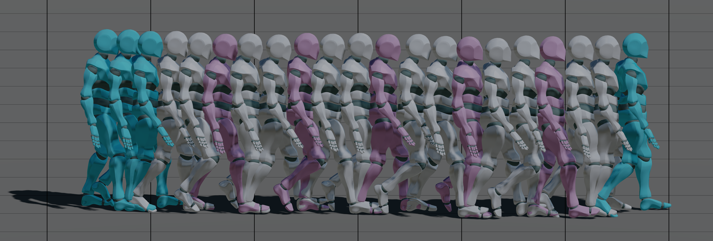

# [SCA 2024] Long-term Motion In-betweening via Keyframe Prediction 

Long-term Motion In-betweening via Keyframe Prediction 

[Seokhyeon Hong](https://seokhyeonhong.github.io),
[Haemin Kim](https://www.linkedin.com/in/haem-k/),
[Kyungmin Cho](https://www.linkedin.com/in/kyungmin-cho-8ba02a208/),
[Junyong Noh](https://scholar.google.com/citations?user=u75_aBgAAAAJ&hl=en)

SCA 2024



## Environment Setup
This repository depends on the [aPyOpenGL](https://github.com/seokhyeonhong/aPyOpenGL) framework.
Therefore, clone both this repository and aPyOpenGL together:
```
git clone https://github.com/seokhyeonhong/long-mib.git
git clone https://github.com/seokhyeonhong/aPyOpenGL.git
```
Follow the installation instruction guideline in aPyOpenGL so that the conda environment along with the visualization dependencies can be built.
Because this process doesn't involve installation of pytorch, install pytorch with a compatible version with your CUDA version.

## Preparing Dataset
We use the LaFAN1 and 100STYLE datasets retargeted to the Y-Bot.
For your convenience, we provide pre-processed files of the motion datasets saved in the ```npz``` format.
To download the processed motion features and the rigged character mesh, execute this command below:
```
cd long-mib
gdown --folder 15hIecfW1vFec5wZCQmvRzVZmVtYBT19P
```

If you need raw fbx files, try this:
```
gdown --folder 1yQ-wcmJjDx_fm7tLXGFW5HqYG5SHgitX
mv ./fbx-dataset ./dataset
```
Note that you should change the directory name from ```fbx-datsaet``` to ```dataset``` if you want to try the pre-processing by yourself.

## Pre-trained Weights
We provide the pre-trained weights of our KeyframeNet and RefineNet.
To download the files, execute this:
```
gdown --folder 1LMqlwOwkTgevo9leIZmhcoyGekakkSLB
```

## Data Pre-processing and Training
To train your own weights, you can follow this.
First, training a periodic autoencoder (PAE) is required.
The data pre-processing and training are as follows:
```
python preprocess_pae.py --dataset {lafan1 | 100style}
python train_pae.py --dataset {lafan1 | 100style}
```
All the configurations for training a PAE is described in ```config/{lafan1 | 100style}/pae.yaml```, so you can modify this file if you want to try other variations.

The next step is to train Transformers for motion in-betweening.
The data pre-processing and training are as follows:
```
python preprocess_mib.py --dataset {lafan1 | 100style}
python train_keyframe.py --dataset {lafan1 | 100style} --config {keyframe.yaml}
python train_refine.py --dataset {lafan1 | 100style} --config {refine.yaml} --ctx_config {keyframe.yaml}
```
Similar to the case of PAE, yaml files describe the configurations for the training.
Notice that you don't have to put the full path to the yaml file but just put the file names, and then the code will automatically find it in ```config/{lafan1 | 100style}```.

## Evaluation
After training, evaluations can be done following:
```
python eval/benchmark.py \
    --dataset {lafan1 | 100style} \
    --interp {true | false} \
    --config default.yaml \
    --ts_configs context.yaml detail.yaml \
    --rmi_configs rmi.yaml \
    --ours_configs keyframe-wo-traj.yaml refine-wo-traj.yaml \
                   keyframe-wo-phase.yaml refine-wo-phase.yaml \
                   keyframe-wo-score.yaml refine-wo-score.yaml \
                   keyframe.yaml refine.yaml
```
You can put ```--interp true``` if you want to include evaluation of interpolations, and ```false``` otherwise.
Additionally, if you want to include ablations, you can put multiple configuration as a list.
Keep in mind that KeyframeNet configurations should be given first, while RefineNet configurations should be following it accordingly.

## Visualization
We also provide the visualization of in-betweening results:
```
python vis/vis_mib.py \
    --dataset {lafan1 | 100style} \
    --interp {true | false} \
    --config default.yaml \
    --ts_configs context.yaml detail.yaml \
    --rmi_configs rmi.yaml \
    --ours_configs keyframe.yaml refine.yaml
```
This will provide visual comparisons of different methods, and you can skip having an option if you want to omit rendering of specific ones.
If you want to see the trajectory editing results, you can put one more option: ```--traj_edit {"scale" | "interp" | "replace" | "random"}```.

If you want to see more options for visualization, such as moving characters horizontally and rendering target frames, click ```Options``` in the pannel.

## Citation
To-be-updated